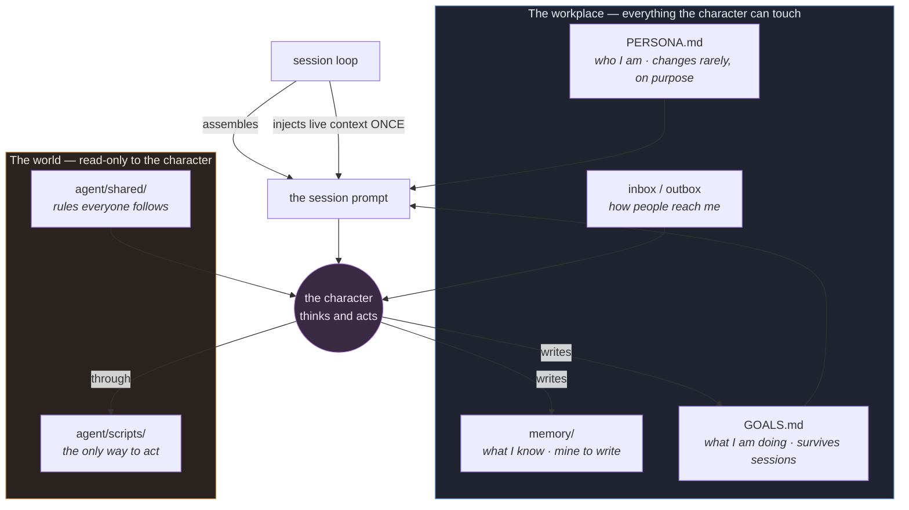
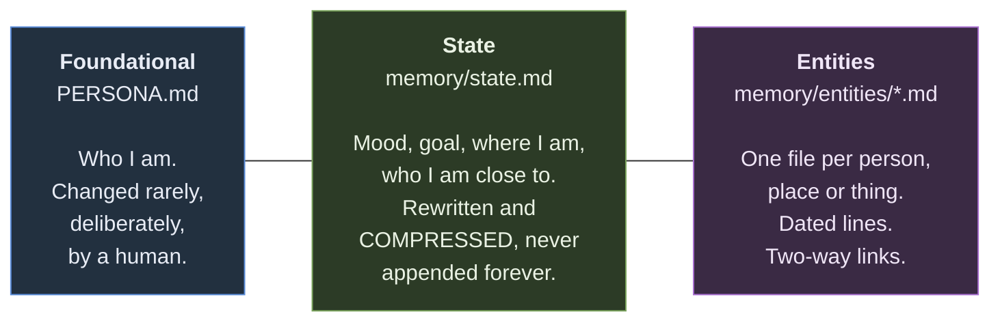

# Persona Lab — проект Кирилла

Учебный проект второго трека AI Persona Lab, осень 2026.
Цель — один автономный ИИ-персонаж с характером, голосом и собственной жизнью
в цифровой среде. Согласованная основа: инопланетянин или неопределённое существо,
которое давно живёт на Земле и многое повидало. Имя, внешность и подробная
личность ещё разрабатываются.

Персонаж должен быть интересен в живом общении, проявлять инициативу,
запоминать взаимодействия и создавать контент от своего имени.
Minecraft, Telegram и Reels рассматриваются как возможные среды и форматы.
Юмор, умеренный абсурд и большая личная биография — ориентиры концепции.

Основа: [3ndetz/agent-workplace](https://github.com/3ndetz/agent-workplace), MIT,
исходная ревизия `fc5f293`. История и лицензия шаблона сохранены.
Проект опубликован в отдельном репозитории по выбору автора; связь с шаблоном
сохранена через историю Git и remote `upstream`.

Для первой домашней работы здесь подготовлено рабочее место на основе шаблона:
контекст проекта в корневом `AGENTS.md`, документация и исходный пример.
Это начальный этап проекта; разработка запуска персонажа относится к следующим шагам.

**Сейчас работает:** проверка примера и сборка промпта Vesper.
**Ещё нет:** вызова модели, Telegram/Instagram, голоса, генерации видео,
планировщика и автономного запуска. Vesper оставлен как учебный пример.

Для проверки достаточно Python 3; из корня проекта:

```sh
python3 tools/check.py
python3 tools/compose_session.py vesper
```

Вторая команда печатает контекст для модели, а не ответ персонажа.

- [Карта кода и следующие шаги](docs/code-map.md)
- [Контекст курса](docs/course-context.md)
- [Первая домашняя работа](docs/homework-1.md)
- [Инструкции помощнику-разработчику](AGENTS.md)

Ниже сохранено исходное описание шаблона организаторов.

# agent-workplace

**An agent is not a prompt. It is a character with a place to work.**

This is a repository template for building autonomous AI characters that live somewhere, remember
people, act through a fixed set of tools, and keep working while nobody watches. It is the
skeleton of a design that has been running in production, with the character and the game
stripped out and a fictional example put in its place.

Fork it with the green **Use this template** button, replace the example character with yours,
and you have a working shape on the first day instead of the fourth month.

---

## The idea in one picture



Nothing about behaviour lives in code. The character is files, the rules are files, the plan is a
file. The loop only assembles them and hands the result to a model.

---

## Why not just write a long prompt

Because a prompt works once. The second character means copying it, and a copy drifts: six weeks
later there are four versions and nobody knows which one is real. The second *situation* is worse,
because now the same character behaves differently in two places for no reason anybody wrote down.

A workplace fixes both. One character file, one set of rules, one plan, assembled fresh every
session. Change the character and every session changes. Change nothing and every session is the
same character.

The second reason is memory. A prompt has none. A character that meets somebody twice and does not
remember the first time is not a character, it is a chatbot with a costume on.

---

## What is in here

| path | what it is |
| --- | --- |
| `agent/AGENTS.md` | the operating manual every character reads before every session |
| `agent/shared/` | rules that apply to everyone: how to behave, what is forbidden, how to post |
| `agent/scripts/` | the only way to act on the world. The character never runs infrastructure |
| `agent/vesper/` | a complete fictional character, with fake data, as a worked example |
| `tools/compose_session.py` | assembles a session prompt from the character plus live context |
| `docs/ARCHITECTURE.md` | the boundary, the three memory layers, how a session runs |
| `docs/MEMORY.md` | the memory model in detail, with the format of an entity note |

---

## Try it now

```bash
python3 tools/compose_session.py vesper
```

That prints the exact prompt a session would receive: the character, the standing rules, the plan,
and whatever arrived since last time. Edit `agent/vesper/PERSONA.md`, run it again, and watch the
prompt change with no code touched. That is the whole design, and it is worth feeling before
reading another word.

```bash
python3 tools/check.py
```

Checks that the example is internally consistent: every character has the files the loop expects,
every memory link points at a note that exists, and the state file has not quietly grown into a
context-window problem.

---

## The three layers of memory

This is the part most people get wrong, and it is what makes a character feel continuous.



The middle one is where systems fail. State that only grows becomes the entire context window, and
then every session pays for every session before it. In the system this template comes from, a
state file reached 117 KB against an 18 KB character, and a single session cost four dollars.
Rewriting and compressing is the character's own job, and it is written into the rules as a job
rather than left as a hope.

The third layer is what makes a character remember *people*. One file per entity, dated lines, and
`[[links]]` in both directions, so the notes form a graph you can open in Obsidian and actually
look at.

---

## The boundary

The character writes inside its own directory and nowhere else. It does not run containers, it
does not SSH anywhere, it does not touch the infrastructure that runs it. It observes through
scripts and acts through scripts.

This is not about trust. It is that a character which can reach everything will eventually break
something at three in the morning while nobody is reading, and the failure will look like the
character being strange rather than like a permission being wrong.

---

## Making it yours

1. **Use this template** and clone your copy.
2. Copy `agent/vesper/` to `agent/<your-character>/` and rewrite `PERSONA.md`. Keep the two-part
   shape: a core that a human sets and the character does not touch, and everything else.
3. Empty the example memory. Keep `memory/README.md`, it explains the format to your character.
4. Replace the scripts in `agent/scripts/` with the real actions of your world. The signature is
   the contract: a script takes plain arguments and prints a plain result.
5. Wire `tools/compose_session.py` into your runner. It prints to stdout on purpose, so it works
   with anything that accepts a prompt.
6. Write the shared rules in `agent/shared/` as you learn them. That directory grows one hard-won
   sentence at a time and is the most valuable thing in the repository after a year.

---

## What is deliberately not here

No runtime, no scheduler, no vendor. How sessions are launched, sandboxed and paid for differs for
everyone, and baking one answer in is how a template stops being useful to anybody else. What
transfers is the shape, the rules and the memory model.

## Licence

MIT.
