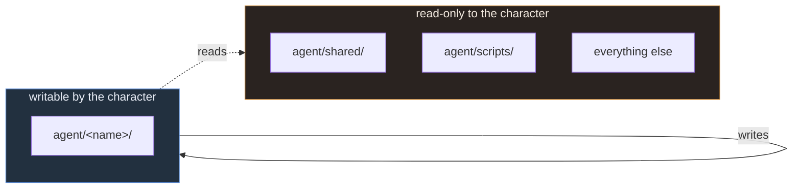
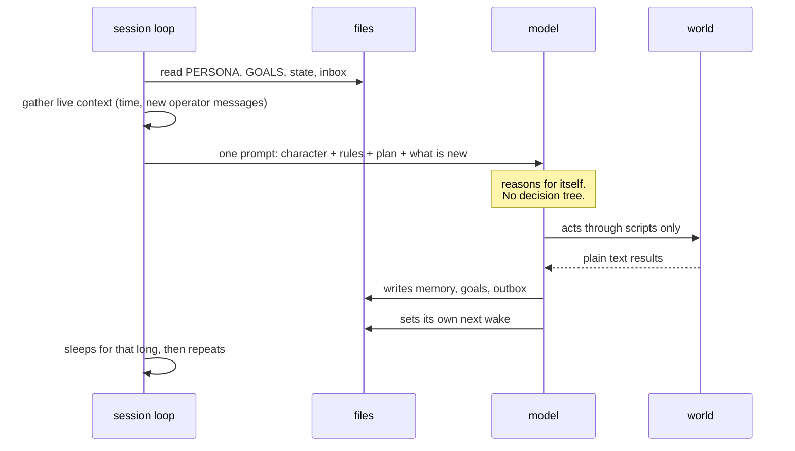
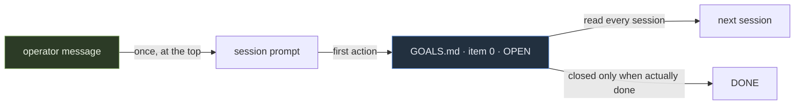

# Architecture

## The boundary

One rule: a character writes inside its own directory and nowhere else. Everything outside is
readable and unwritable.

This is not distrust. A character that can reach everything eventually breaks something at three
in the morning while nobody is reading, and the failure looks like the character behaving oddly
rather than like a permission being wrong. Narrow write access turns a whole class of mystery into
a script that says no.

## A session, start to finish

The loop assembles and hands over. It contains no rule about any character and no special case for
any situation. When the output is wrong, a file is wrong, and that property is the reason the
design is worth having.

## What arrives exactly once

Operator messages are injected at the top of the prompt and never repeated. That is deliberate:
an inbox the character re-reads every session replays old orders forever, and the character ends
up spamming somebody with a task from last Tuesday.

The consequence is a rule: the first thing done with a once-delivered message is to write it into
`GOALS.md`. A plan file survives sessions; a prompt does not.

## Adding a second character

Copy the directory and change the name. Nothing else. Shared rules stay shared, scripts stay
shared, and the two characters cannot read each other's memory because neither can write or read
outside its own directory.

Two characters that must know about each other do it the way people do: by talking, through the
outbox, and by writing what they learned into their own notes.
